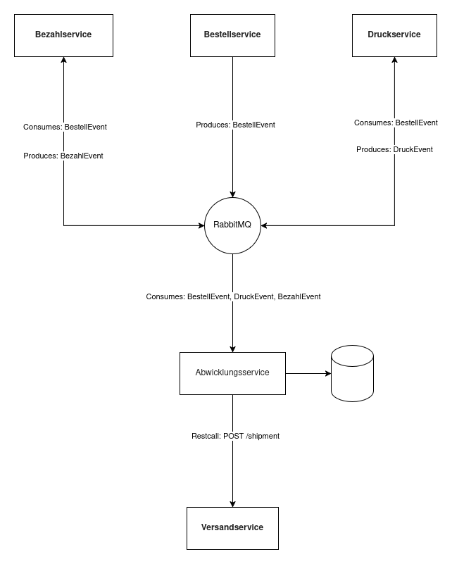

# Abwicklungsservice

## Annahmen
- Der Bezahl- & der Druck-Service konsumieren das selbe Bestellevent wie der Abwicklungsservice (bzw. werden zu einen dichten Zeitpunkt getriggert), 
woraufhin sie ihre Events produzieren. -> Die Reihenfolge des Eventsempfangs ist nicht fest.

## TODOs
- VersandService client
- RabbitMQ consumers
- RabbitMQ test setup
- CI/CD
- Warmup & health check
- Pact tests
- some edge case handling
- Pin dependency versions
- DB indices
- finish Abwicklung-Recipient relation logic
- add swagger UI and document endpoints
